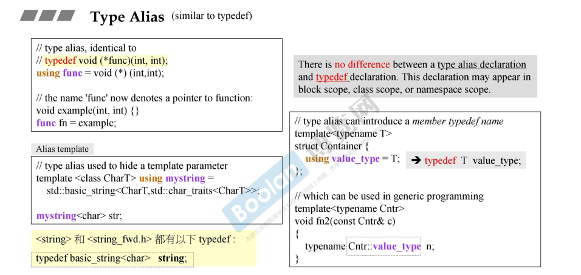
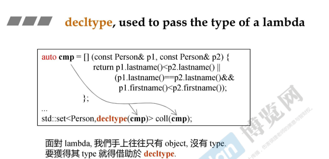
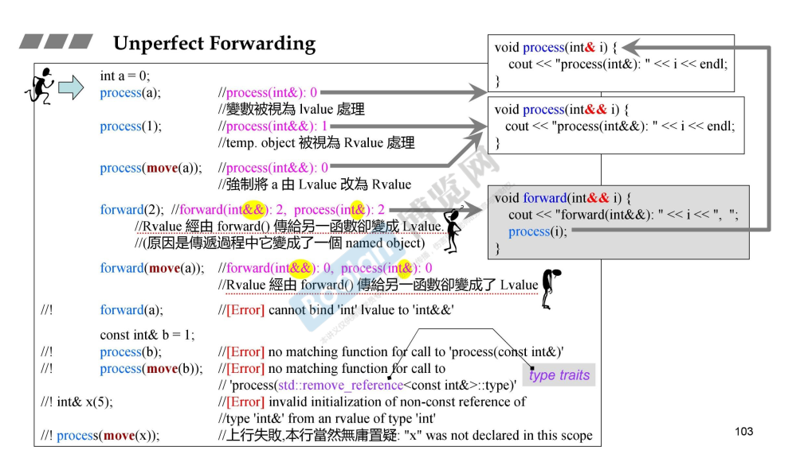
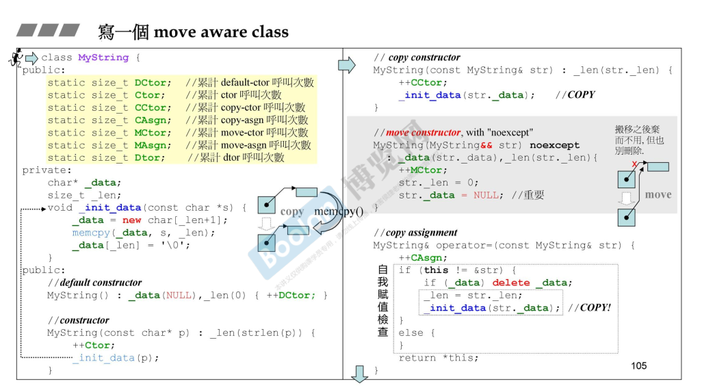

## 语言

#### ⭐variadic templates 可变模板参数 `typename... Types`

下图中函数2和3可以共存，函数2其实是函数3的特化

`...`是一个关键字，表示一个pack，`...`可以用于模板参数pack、函数参数类型pack、函数参数pack，如下图代码。 

```c++
void print() {}
template<typename T,typename... Types>
void print(const T& fisrtArg,const Types&... args){
	cout<<firstArg<endl;
	print(args...);
}
```


##### 用处：std::tuple

递归函数调用


下图是tuple的构造过程，右边显示了继承关系。

tuple由父类inherited和m_head构成，在内存中，先构造父类后构造子类，**父类的部分一般位于低地址**（编译器决定），以下图为例，右侧的继承关系可以反映构造函数调用顺序，最终"nico"位于最低的地址，4位于最高的地址处。

当调用tail函数时，返回父类部分的引用。

当我们说 `tuple` 的 **tail（尾部）** 时，通常是指：

- 给定一个 `tuple` 包含多个类型，比如 `tuple<int, double, string>`；
- 它的 **head（头部）** 是第一个类型 `int`；
- 它的 **tail（尾部）** 是剩下的类型 `double, string`。


#### spaces in template expressions

在过去，`vector<list<int> >`最后一定要有空格隔开；c11之后不需要了


#### nullptr 和 std::nullptr_t

nullptr是一个新的关键字，**专门表示空指针的字面量**，其类型是 `std::nullptr_t`。

`nullptr` 可以隐式转换为任何指针类型（比如 `int*`、`void*` 等），但**不会隐式转换为整数类型**，

使用nullptr代替NULL，因为NULL被定义为0，当NULL作为参数传递时可能有二义性，如`void f(void*), void f(int)`，函数由`int`作为参和`void*`作为参的两个版本。

`std::nullptr_t` 是 `nullptr` 的类型，它是在 C++11 中引入的一个**标准库类型**，定义在头文件 `<cstddef>` 中。


#### auto

**简化变量声明**

类型名称比较长的时候经常使用，比如迭代器类型

还用于**表示lambda函数对象**。得到一个object

lambda本质上是一个匿名类，function-like class，实现了operator()


`auto` 的类型推导规则

|           初始化表达式           | 推导出的类型 |                         说明                         |
| :------------------------------: | :----------: | :--------------------------------------------------: |
|    `int a = 10; auto b = a;`     |    `int`     |               完全保留变量 `a` 的类型                |
| `const int a = 10; auto b = a;`  |    `int`     |               `auto` 会忽略顶层 const                |
| `const int& a = 10; auto b = a;` |    `int`     |            `auto` 会忽略引用和顶层 const             |
|          `auto& b = a;`          | `const int&` |          使用 `auto&` 可以保留引用和 const           |
|         `auto&& b = a;`          | `const int&` | 万能引用，根据初始化表达式决定是左值引用还是右值引用 |


#### uniform initialization

**c11之前，初始化可能发生在小括号，大括号，赋值运算符（下图左下方）。**

c11之后，可以统一使用大括号。

其原理是：**编译器遇到大括号，会处理成一个`initializer_list<T>`，其背后是`array<T,n>`**

注意下面的例子，但ctor可以接受initializer_list<T>作为参数时，即直接传入initializer_list<T>；否则，将其分解后传给ctor的各个参数。

**所有的容器都提供了接受initializer_list<T>的ctor**


#### ⭐ initializer list

##### 大括号会自动防止窄化 

默认初始化为0；

一旦使用{}初始化，窄化时会warning


##### 背后原理 initializer_list< T>


**ctor可接受initializer_list时，优先使用这个ctor。 （下图左**

下图右，是initializer_list的代码。

编译器层面，编译器遇到{}时，编译器确定数组大小；运行时，遇到{}会先初始化静态数组array，即将元素拷贝到分配的数组空间，这个数组是一个临时对象；之后会调用initializer_list的私有构造函数初始化内部的array迭代器。

initialzer_list只有array的视图，且array和initializer_list都是临时对象，在外围的容器构造完成后，二者都会销毁。


**下图中`_M_elems`为`_Tp[_Num]`数组类型**


initializer_list中存放的是array的指针（迭代器）

`std::initializer_list` 并不实际存储元素，而是提供了一种 **轻量级的 "视图"**，指向一个底层的、由编译器生成的 **静态数组**。

**下图中展示了构造对象的三种写法：小括号，大括号，=。**

其中`P s={77,5}`等价于`P q{77,5}` ，**= {77，5 }是一种隐式转换**


##### 用处

**下图说明所有容器支持使用{}进行初始化，赋值，insert，assign。min,max也支持接受{}中任意个数元素**


#### explicit

explicit ctor不允许隐式转换。

`A a1={1,2}`这种初始化方式本质是一种隐式转换，会隐式的调用`A({1,2})`

```c++
#include <initializer_list>
#include <iostream>

class A {
 public:
  explicit A(int a, int b) { std::cout << "A(int,int) called" << std::endl; };
  explicit A(int a, int b, int c) {
    std::cout << "A(int, int,int) called" << std::endl;
  };
  explicit A(std::initializer_list<int> init) {
    std::cout << "A(std::initializer_list<int>) called" << std::endl;
  };
  A operator+(const A &other) { return A(0, 0); };
};

void fa(const A &){};

int main() {
  A a1(1, 2);
  A a2(1, 2, 3);
  A a3{1, 2, 3};
  A a4 = {1, 2, 3};
  A a5 = {1, 2};

  fa({1, 2});
  fa({1, 2, 3});

  return 0;
}
```

```c++
main.cpp:22:18: error: converting to ‘A’ from initializer list would use explicit constructor ‘A::A(std::initializer_list<int>)’
   22 |   A a4 = {1, 2, 3};
      |                  ^
main.cpp:23:15: error: converting to ‘A’ from initializer list would use explicit constructor ‘A::A(std::initializer_list<int>)’
   23 |   A a5 = {1, 2};
      |               ^
main.cpp:25:5: error: converting to ‘const A’ from initializer list would use explicit constructor ‘A::A(std::initializer_list<int>)’
   25 |   fa({1, 2});
      |   ~~^~~~~~~~
main.cpp:26:5: error: converting to ‘const A’ from initializer list would use explicit constructor ‘A::A(std::initializer_list<int>)’
   26 |   fa({1, 2, 3});
      |   ~~^~~~~~~~~~~
```


non-explicit one argument constructor允许单参数隐式转换


#### range-based for statement：范围for循环

`auto&`取元素，才可以改变元素


本质是利用迭代器遍历容器，并获取元素。或者时利用全局begin()、end()函数。

这是编译器做的行为。


#### =default，=delete，=0

一般而言，开发者提供某种构造函数时，编译器则不会提供默认构造函数（没有任何参数）和该签名的构造函数；比如开发者提供拷贝构造，则编译器不会提供默认构造和拷贝构造了。

=default会让编译器提供一个空构造函数。=delete则会删除指定构造函数。

=default可用于构造函数：默认构造，带参构造，拷贝构造，移动构造；以及拷贝赋值和移动赋值。


析构函数可以 =default，不能=delete（会导致无法析构，不能编译）

一般函数可以用=delete，但不能=default（编译器不知道如何提供）

`=0` 用于**声明纯虚函数**，使类成为**抽象类**（不能直接实例化），强制派生类必须实现该函数。

##### **Big-Five**

类中五个特殊的成员函数：析构函数，拷贝构造，拷贝赋值，移动构造，移动赋值。

当开发者不提供时，编译器会在需要时提供。


##### 深拷贝

当class含有pointer member时，如string，一般需要开发者自己提供big-five（深拷贝）

而不含pointer member时，如complex<T>, 使用默认的big-five即可，不需要开发者提供

##### 用处

控制类不可拷贝，常见于定义一个noncopyable作为基类


#### ⭐Alias(化名)  Template  （使用using）

typedef和macro都无法达到using的效果。

**using可以对模板定义别名，且别名可以接受<>参数。**


##### 案例：如何接受各种容器作为参数，并构造相同容器进行测试

下图给出一份代码，用于测试容器的移动构造函数的效率。其中用到了Alias Template技巧。

这个代码存在很多error，需要修改。


###### 解法1：传入容器临时对象，利用模板函数自动推断容器类型，利用iterator_trait获取类型


上图的局限在于，使用了STL的`iterator_traits`萃取机制。

###### ⭐解法2：利用模板模板参数，传入容器的类型和元素的类型

下面提供了另一种写法，传入容器的名称和元素类型。

下面报错，原因在于vector和`template<class> class Container`不匹配。前者有两个模板参数，后者只有一个。编译器不知道vector的第二个模板参数有默认值。


改成下面的形式，使用using对`vector<T,allocator<T>>`声明别名

```c++
template <typename T>
using Vec = vector<T,allocatot<T>>；
```


#### Type Alias (使用using)

```c++
typedef void (*func)(int,int);// 难以看出func是个别名
using func = void (*)(int,int);  //和上面等价，但是可读性更好

void example(int,int) {};
func=example;

```



#### using总结


* type alias

* template alias

* using-directives for namespace and using-declarations for namespace members

  则直接使用namespace成员，不需要namespace::来访问

* using-declarations for class members，便于直接使用class的成员，无需class::

#### noexcept ：明确声明函数不抛出异常

noexcept有条件。下图swap代码表示，当x.swap(y)无异常时，函数才不抛出异常。

cpp中异常必须被处理，如果异常抛出之后没有被所在函数处理，则会一直向父函数传递，直到被处理或teminate终止。

下图中，foo中如果没有处理自己throw的异常，异常向上传递后，程序直接调用abort终止。（因为foo违反了noexcept声明）


##### 和移动语义结合使用

C++ 标准规定：

- 如果 `vector` 的元素类型 `T` 的移动构造函数是 `noexcept` 的，`vector` 会在扩容时优先使用移动构造。特别的，当T是含有pointer members的class时，移动构造更高效。
- 如果 `T` 的移动构造函数**不是 `noexcept`** 的，`vector` 会使用拷贝构造（即使 `T` 有移动构造函数）。

这是为了避免内存泄漏，要么成功move，要么失败终止。

如下题的MyString中，声明了noexcept。


#### override

函数被标明override时，需要和被override的函数有相同的函数签名（相同的函数名和参数列表）

下图中，上半部分是重载了一个新的虚函数，而不是override

下半部分，**显式的标明override之后，编译器会检查是否真的override**，否则报错。


#### final

**显式标明类无法被继续继承**

**显式标明虚函数无法被override**了 （当前是final版本）


#### decltype

declare-type的缩写。

`decltype` 的行为比 `auto` 更精确，因为它能**保留表达式的值类别（左值/右值）和引用性质**。

三个应用，声明返回类型、用于元编程、传递lambda函数的类型。


##### 声明变量

**直接声明与某个表达式类型相同的变量**

```c++
std::vector<int> vec = {1, 2, 3};
decltype(vec.begin()) it = vec.begin();  // it 的类型是 std::vector<int>::iterator
```

##### 声明返回类型


##### 元编程

推导元组的类型。


##### 传递lambda object的类型




```c++
#include <string>
#include <set>
#include <iostream>

struct Person {
    std::string name;
    int age;

    // 构造函数（可选）
    Person(const std::string& n, int a) : name(n), age(a) {}
};

int main() {
    // 定义 Lambda 比较函数
    auto personCompare = [](const Person& a, const Person& b) {
        if (a.age != b.age) {
            return a.age < b.age;
        } else {
            return a.name < b.name;
        }
    };

    // 声明 set，并传入 Lambda 比较函数
    std::set<Person, decltype(personCompare)> personSet(personCompare);

    // 添加元素
    personSet.emplace("Alice", 25);
    personSet.emplace("Bob", 20);
    personSet.emplace("Charlie", 25); // age 相同，按 name 排序

    // 遍历 set（按自定义规则排序）
    for (const auto& p : personSet) {
        std::cout << p.name << " (" << p.age << ")\n";
    }

    return 0;
}
```

下面是set的源码

其可以接收两个模板参数，其中_Compare是一个function-like class类型，set的构造函数可以接收一个function object（function-like class的object）作为参数进行构造。

```c++
  /// Class std::set with safety/checking/debug instrumentation.
  template<typename _Key, typename _Compare = std::less<_Key>,
	   typename _Allocator = std::allocator<_Key> >
    class set
    {
      set(initializer_list<value_type> __l,
          const _Compare& __comp = _Compare(),
          const allocator_type& __a = allocator_type())
        : _Base(__l, __comp, __a) { }
        
      explicit set(const _Compare& __comp,
		   const _Allocator& __a = _Allocator())
      : _Base(__comp, __a) { }
    }
```


#### ⭐lambdas

lambda允许定义一个仿函数object (function-like class的object)

下图说明了lambda的两种用法，第一种不带名称，声明后再最后加()进行调用，调用完就弃用了；第二种通过auto 声明一个仿函数对象，之后像使用函数那样，使用这个object。


```c++
[capture-list](parameters) specifiers -> return-type { body }
```

| 捕获方式    | 描述                                        |
| ----------- | ------------------------------------------- |
| `[]`        | 不捕获任何外部变量                          |
| `[=]`       | 以值方式捕获所有外部变量                    |
| `[&]`       | 以引用方式捕获所有外部变量                  |
| `[var]`     | 以值方式捕获变量 var                        |
| `[&var]`    | 以引用方式捕获变量 var                      |
| `[=, &var]` | 以值方式捕获所有变量，但 var 以引用方式捕获 |
| `[&, var]`  | 以引用方式捕获所有变量，但 var 以值方式捕获 |
| `[this]`    | 捕获 this 指针                              |
| `[*this]`   | 捕获当前对象的副本（C++17）                 |

下图说明了lambda的语法。


##### mutable

**mutable表示可以修改内部定义的捕获的value**，于是function对value的修改不会改变外部变量，只改变内部自己定义的变量。示例代码如下图。

lambda本质是一个匿名的function-like class。


##### 本质

lambda本质是一个匿名仿函数。（**仿函数也叫函数对象类，是重载了operator()的class，可以用该class创建函数对象，像使用函数那样使用这个object**)

在构造时，传入捕获的变量，捕获的变量在class内部定义。


##### 结合模板使用

可以通过auto声明lambda这个匿名类的object，通过decltype获取object的类型。

set是一个模板class，其第二个模板参数可以为class类型。通过decltype获取object的类型，即class类型。而set的构造函数可以接收一个class object（即cmp，仿函数object）进行构造。


#### ⭐重回variadic template 

指的是在函数模板和类模板中，参数类型和个数可变。

语法如下，注意三点`typename... Types&... args...`


##### 案例

###### 可接受各种参数的函数：printx

递归的处理参数


###### 重写printf


###### max：基于initializer_list<T>

基于标准库的max_element。


###### max : 基于variadic templates

递归调用std::max


###### PRINT_TUPLE

sizeof...()获取元素个数

get<idx>(t)取出tuple元素

```c++
template <int IDX, int MAX, typename... Args>
struct PRINT_TUPLE {
    static void print (ostream& os, const tuple<Args...>& t) {
        os << get<IDX>(t) << (IDX+1==MAX ? "" : ",");
        PRINT_TUPLE<IDX+1, MAX, Args...>::print(os,t);
    }
};

// partial specialization to end the recursion
template <int MAX, typename... Args>
struct PRINT_TUPLE<MAX, MAX, Args...>   {
    static void print (std::ostream& os, const tuple<Args...>& t)  {
    }
};

// output operator for tuples
template <typename... Args>
ostream& operator<< (ostream& os,
                     const tuple<Args...>& t)
{
 	os << "[";
	PRINT_TUPLE<0, sizeof...(Args), Args...>::print(os,t);
	return os << "]";
}
```


###### tuple，递归继承，recursive inheritance

```c++
template<typename... Values> class tuple;
template<> class tuple<> { };

template<typename Head, typename... Tail>
class tuple<Head, Tail...> 
  : private tuple<Tail...>
{
    typedef tuple<Tail...> inherited;
 public:
    tuple() { }
    tuple(Head v, Tail... vtail)
      : m_head(v), inherited(vtail...) {	}

    Head head() { return m_head; }  	
          
    inherited& tail() { return *this; }//注意返回类型为父类inherited
 protected:
    Head m_head;    
};
```


###### tuple另一种实现，递归组合，recursive composition 


## STL

#### Rvalue reference 右值引用

引入是为了节约非必要的copy。当赋值的右边是右值时，左边的左值可以窃取资源而不是重新分配内存并拷贝。

左值：可以出现在=左边。

右值：只能出现在=右边。

下图说明**temp object是右值，右值没有明确的变量名。**另外，可以把左值声明为右值，表示左值不在被使用，资源可以被窃取。

（不需要关心下面的示例，string()可以放在左边，但它是个右值）


函数return by value时，返回值即为右值，右值不可以取地址，且没有对右值的引用。（只能对有明确名称的变量，即对左值取地址）


##### 具体使用

如果vector的元素T为含有pointer的class，当使用临时对象进行insert时、当vector扩容时，理应优先使用移动构造函数，**右值（临时对象）则用于告诉编译器优先使用移动构造和移动赋值函数**。并且条件是：**移动构造和移动赋值函数必须为noexcept**，编译器才会进行优化。

使用&&声明函数的参数为右值。如insert函数有insert(..., &x)和insert(...,&&x)两个版本。

当左值不再使用时，std::move用于将左值声明为右值。之后优先使用移动构造和移动赋值。


#### perfect forwarding完美转发

完美转发的核心是**保留参数的原始值类别**（左值→左值，右值→右值）。这需要编译器通过模板参数 `T` 推导 `arg` 是左值还是右值。

**`std::forward`**


下图是一个错误示例，一个右值进入forward函数之后，变成了一个named object，之后变成左值传给process函数了。



#### 如何设计一个可move的class 手撕string




