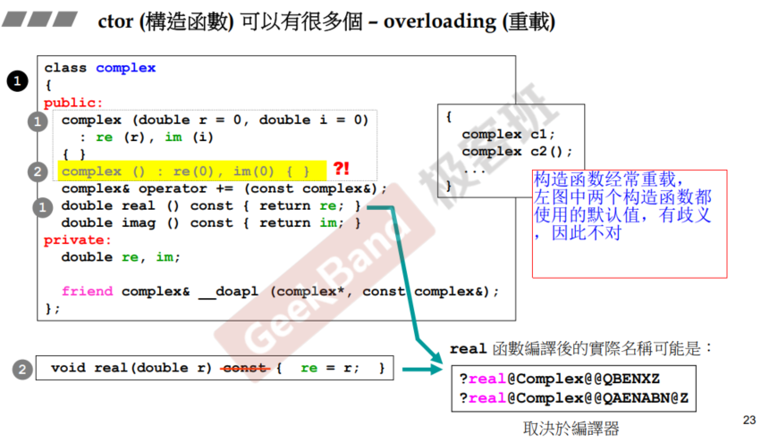

这门课在讲述时，主要讲了complex和string类，根据成员是否带指针来区分。涉及对构造函数和析构函数的编写，以及拷贝构造和赋值函数时注意深拷贝。

在类的关系上，也分为composition、delegation、inheritance三种，其中delegation通过指针指向另一个类。

在inheritance方面，需要关心虚函数和多态。

类的三种关系进行组合，可以有多种设计模式。

####  类的两种设计

带指针和不带指针有区别；

在拷贝构造和拷贝赋值时，涉及深拷贝和浅拷贝，需要自己实现深拷贝的构造和赋值函数。

#### 头文件的防卫式声明

避免重复include

```cpp
#ifndef __xxx__
#define __xxx__

#endif
```


####  类内定义的函数要短小 此时可作为内联函数候选（默认inline）

对于类的成员函数，如果在类内部定义（即直接在类体中实现），则该函数默认为`inline`候选，无需显式添加`inline`关键字。

但若在类外部定义成员函数，则需显式添加`inline`关键字。

函数被声明为inline之后，会由编译器决定是否真的是inline。


#### 优先使用构造函数的列表初始化


#### 为什么可以重载

同样的函数名在编译后其实名称是不同的



#### 单例模式：构造函数用private保护，使用static成员函数调用构造函数


#### const成员函数，const修饰this指针时，才能定义const类对象。否则会有权限扩大问题


#### 传参尽量by ref ，思考是否用const和引用&，引用传递类时，相当于按指针传递


#### Return尽量by ref

返回值是本来就有的，可以return by ref。返回值需要临时创建，则需要return by  value

`operator<<`重载


`operator+=`返回引用，而`operator+`返回value

#### 友元


 即c2可以访问c1的私有成员变量

#### 操作符重载：成员函数和非成员函数

二者第一个参数有区别 ，成员函数第一个参数为this指针

do assignment plus 

##### operator+

`operator+=`return by ref 

注意`operator+`return by value，返回一个临时对象


***


##### operator-

负号和减运算符的区别在于参数数量不同，负号是一元运算符


##### output运算符

**一定不能是成员函数**，`<<`的参数在左右两边，左边是第一个参数，右边是第二个参数，且返回ostream。第一个参数一定时ostream。

ostream不可以加const，因为要修改os


 #### 带指针的类：  拷贝构造、拷贝赋值、析构

  申请内存、深拷贝、释放内存


一定要检测自我赋值，不然会发生错误，因为先`delete[] m_data`，再访问m_data会错误

#### new和delete的实际过程

new:  

* ==为类的实例分配内存== 
* void*==转型==， 
* pc指针调用构造函数   (==在string实现中，这一步才会给字符串分配内存==)


delete : 

* 析构函数（complex的析构函数不做事情，string的析构函数会释放字符串占用的内存）
* 释放内存（收回类的实例所占的内存）


对string的指针进行delete，先析构函数释放字符串所占内存，之后释放对象所占的内存。


#### 为什么cout可以接受各种类型


因为cout对`operator<<`进行了多种重载，使得<<操作符可以接受多种参数

### 类的关系：继承 组合 委托； UML图

==都是面向对象的关系==

#### composition , 组合 has-a

**直接包含component，寿命是相同的，内存上是包含的，构造和析构时是同步的，寿命相同。**

component修改时，container也需要重新编译。


内存上是包含关系


**构造由内而外**，先执行component的构造函数，一层层包装。

**析构由外而内**，一层层解包装，进行清理。

下图中红色部分是编译器帮我们处理的，实际自己写代码时，并没有手动编写，而编译器会选择默认版本。


#### Delegation 委托 (composition by reference)

使用**指针指向component，并非真的拥有，内存上没有包含component实例，其寿命也不一致。**

pImpl，pointer to impletion，指针指向实现。也叫Handle/Body

真正的实现可以被修改，并且不影响左边。 因此这种手法被称为编译防火墙，右边修改时，左边不需要重新编译。


####  Inheritance 继承 is-a（是一种）

 子类包含父类的成员变量和函数，

内存上看，子类对象含有父类的成分

构造也是由内而外，析构由外而内。并且编译器自动帮我们调用父类的构造和析构函数。


### 继承、多态和虚函数

**一个良好的编程习惯是，父类的析构函数编写为virtual函数**


 ##### 设计模式 模板方法 template method

定义一个操作的算法的骨架，而将一些步骤延迟到子类中。使得子类不改变算法的结构即可重新定义算法的特定步骤。

这个设计模式中，父类的函数中调用虚函数，定义好逻辑。然后子类去实现自己的虚函数，并执行上述逻辑的子类版本。

**当我们要完成层次一致的一个过程或一系列步骤时，个别步骤在实现上可能不同，这时候可以考虑该模式。**

成员函数的第一个参数是this，在下面这个例子中，调用`OnFileOpen`时传入`CMyDoc`指针，接着传给`Serialize()`，接着通过this指针调用`CMyDoc::Serialize()`


### 继承+组合时  构造函数调用顺序

根据内存的布局，构造由内而外，析构由外而内


### 继承+委托

##### observer   观察者模式

设计一个UI页面，可以开多个窗口观察同一份数据。

观察者模式：**一种一对多的关系，多个观察者监听某个主题。主题状态变化时通知观察者对象更新。**


这个例子中，Subject保存数据，可以通过多个observe观察数据。

核心在于，observer创建时attach到subject，subject赋值时更新observer


##### Composite  组合模式

将对象组合式树状结构，表示“部分-整体”的层次结构。**组合模式使得用户对单个对象和对组合对象的使用具有一致性，不关心自己处理的是叶节点还是组合组件。**

如文件系统，目录中可以放文件，也可以放目录。

如公司架构，树状结构


##### ProtoType 原型模式

使用场景：需要创建未来才会声明的类实例。

**通过这个模式，让未来的类设计时创建一份实例，注册到框架的父类，父类通过原型来创建这些子类实例。**

步骤：

1. 定义一个克隆接口
2. 实现克隆方法，clone方法创建新对象
3. 通过克隆现有对象来创建新对象，原有对象只有一份


在下面的代码中 Image类存放prototype

LandSatImage类中，含有static的类实例作为原型，且原型实例第一次创建时注册到Image类的_prototypes中，之后通过clone接口来创建其他实例。

注意有两个构造函数，无参的在创建原型时只调用一次，含参的在clone时调用。


使用示例，static的原型实例会自动注册到_prototypes中，通过findAndClone调用原型类的clone接口

