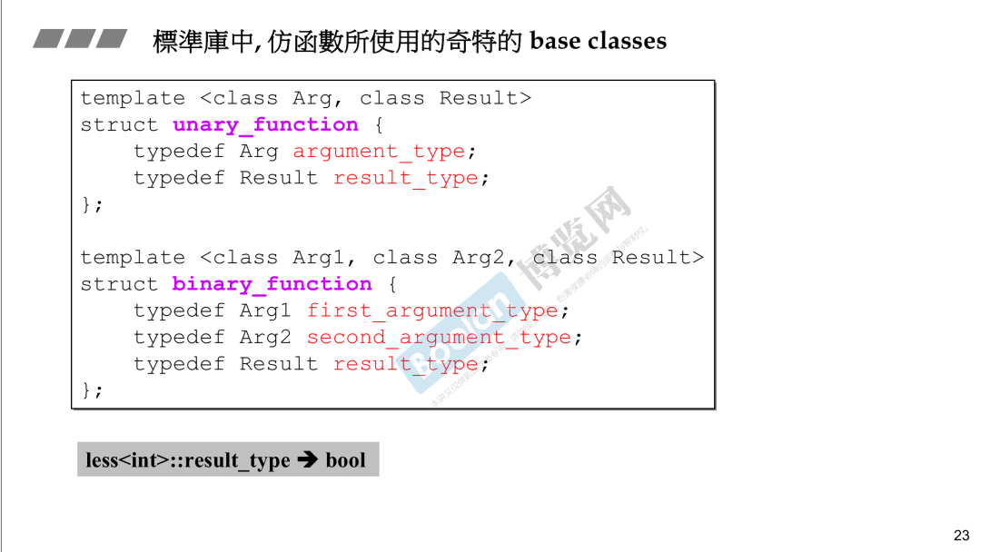
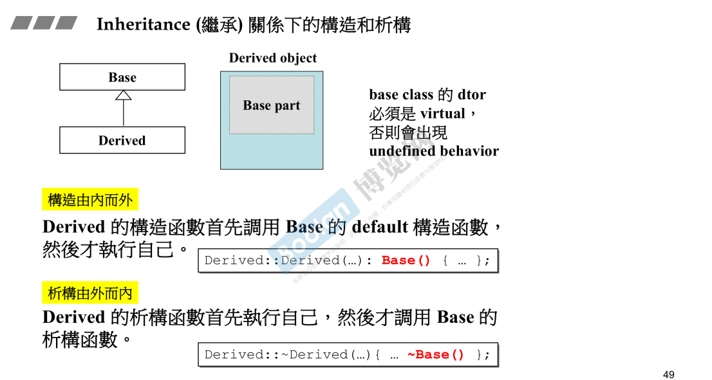

###  转换函数和隐式转换

==explicit一般用在构造函数前面，用于明确告诉编译器不要隐式转换，必须显式调用构造函数。==

#### conversion function转换函数

`operator 目标类型() const {return ...}; // 通常加 const，因为转换不应该修改对象` 

目标类型可以是另一个类

```c++
#include <iostream>

class AnotherClass {
private:
    double value;
public:
    AnotherClass(double v) : value(v) {}

    void print() const {
        std::cout << "AnotherClass value: " << value << std::endl;
    }
};

class MyClass {
private:
    int value;
public:
    MyClass(int v) : value(v) {}

    // 转换函数：MyClass -> AnotherClass
    operator AnotherClass() const {
        return AnotherClass(static_cast<double>(value));  // 转换为 double 再构造 AnotherClass
    }
};

int main() {
    MyClass obj(42);
    AnotherClass another = obj;  // 隐式转换：MyClass -> AnotherClass
    another.print();  // 输出 AnotherClass value: 42

    return 0;
}
```


上述例子是隐式转换，将f转换为double类型

隐式转换在编译期进行检查

#### non-explicit-one-argument ctor 隐式构造函数

非显式的单参数的构造函数

可以接受一个实参来构造对象，隐式转换，如下图，将4转换为Fraction对象


下图有二义性，因为对象f可以转换为double，4可以隐式转换为fraction对象


#### explicit-one-argument ctor 显式构造函数

禁止隐式转换

下图中4无法被转换为fraction对象，f虽然可以转换为double，但是相加后无法隐式构造d2


#### 转换函数的示例

下图中vector保存bool值，operator[]应该返回bool值，因此reference应该有转换函数，将其转为bool。


### 两种class

#### pointer-like class ，关于智能指针

实现一个像指针的类，用于封装更多的功能。比如智能指针。

这种class需要重载解操作符  `解引用*和箭头符号-> `

下图中`sp->`会被转换为`px`，c++中规定`->`得到的东西会继续通过`->`作用下去，即`px->`继续作用。


#### pointer-like class ,关于迭代器

迭代器需要重载`* -> ++ --`这些运算符

下图的`self operator++(int) ` 是重载后置递增


上图是__list_node的迭代器，对iterator解引用之后，应该取出data

同样的，`->`的行为应该是取data之后，再取data的地址

这和智能指针的实现是不同的。


#### function-like class  ，仿函数

如何像函数，需要重载函数调用操作符()


上图的灰色部分是有内容的，有继承




unary_function指仿函数只有一个参数，binary_function是仿函数有两个参数

这是STL部分的内容

### namespace

防止命名空间冲突，不同部门或者模块可以放在不同的namespace中


### 模板

#### class template

使用时要指明类型


#### function template

**函数调用时，根据参数推断类型，不需要显式指定。**

模板本身可以编译通过，再使用时，指定类型后会再编译一次，这一次可能编译失败，如下图中，stone如果没用重载`operator<`则会编译失败。


#### member template

即黄色部分，他是外围template的一部分，且本身也是template。


用法示例：


上面例子中，p2的first和second变量是Base类型，但是用Derived类型初始化的。

下面这个智能指针的例子中，允许用Derived指针初始化Base指针。因此需要实现member template。

上行转换是允许的。


#### 模板特化

泛化和特化是相反的。

模板就是泛化的一种，用的时候再指定类型。类型可以多种。

**特化就是指定类型后重新实现template。**

特化有一些规则：（下面不全面，需要时自查即可）

* 全特化是一个全新的实现，不会从原始模板继承任何成员函数

- 如果特化版本中未定义某个成员函数，则该函数将不存在于特化版本中

- 如果代码尝试调用未在特化中定义的成员函数，会导致编译错误

  ```c++
  template<typename T>
  class MyClass {
  public:
      void func1() {}
      void func2() {}
  };
  
  // 全特化版本
  template<>
  class MyClass<int> {
  public:
      // 只重新实现了func1，没有实现func2
      void func1() {}
  };
  
  int main() {
      MyClass<double> normal;  // 正常使用原始模板
      normal.func1();          // OK
      normal.func2();          // OK
      
      MyClass<int> specialized; // 使用全特化版本
      specialized.func1();      // OK
      specialized.func2();      // 编译错误！func2未在全特化中定义
      
      return 0;
  }
  ```

  


 上图中hash<long>()表示创建临时对象，(1000)表示调用operator()

#### 偏特化

即局部特化

**个数上的偏特化和范围上的偏特化**。

如STL为vector<bool>实现了偏特化，使用单个bit保存bool值。


范围上的偏，如将任意类型T缩小为指针类型T*，为指针类型T实现一套代码。

C<string*> 使用下面特化的代码。


#### 模板模板参数

即模板作为模板参数


上图中`XCls<string,list> mylist1`用法错误，语法错误。原因XCls的声明中没有为list指定好list的全部模板参数。

通过声明一个Lst可以解决。

stl中list如下：

```c++
template <class T> 
struct __list_node{
	typedef void* void_pointer;
	void_pointer prev;
	void_pointer next;
	T data;
}

template<class T,class Alloc=alloc>
class list {
protected:
    typedef __list_node<T> list_node;
public:
    typedef list_node* link_type;
private:
    link_type node;
  
...
}
```

另一个例子，其中shared_ptr和auto_ptr只接受一个模板参数，XCls可以编译通过。


下图不是模板参数，因为list<int>不是模板了，已经指定int了，无需推断。

对比`XCls<string,list> mylist1`，其接受的第二参数list是个模板，需要根据传入的T推断类型。


### 关于STL

容器 算法 迭代器 仿函数


### 通过宏__cplusplus确认是否支持c11


### c11的语法糖

#### 可变参数模板 `typename... Types`

...就是一个pack，可以用递归的方式逐个处理

可以使用sizeof操作符获取args数量


 #### auto


#### ranged-for


  

### reference

==对object和reference取地址 取sizeof结果相同==，**但这是一个假象，reference实际是指针**

reference的指向不能变

**reference通常不用于声明变量，而用于描述参数类型，返回类型**


传引用比传指针更好，因为传引用和传value在参数调用端和接口调用端写法相同。

传指针的话，传参是还需要取址&。


函数的signature指的是函数名之后的部分，不包含返回值。

函数最后的const也是签名的一部分，即const函数和非const函数是两个不同的函数。

传引用和传value不能并存，因为函数的调用写法一致。

### 复合、继承关系下的构造和析构

构造由内而外

析构由外而内





### 关于vptr和vtbl

注意B中重新实现了`vfunc1`，继承了`vfunc2`，因此B的虚表中有`B::vfunc2()和A::vfunc1()`

类的成员函数只有一份代码，**子类继承的是父类成员函数的调用权**

只要类有虚函数，就有虚表。

下图中有一个指针p，如果p调用vfunc1时，编译器不会在编译期静态绑定函数地址，而是在运行期，通过vptr和vtbl调用函数。

静态绑定时，调用代码会被编译成`call xxx`；动态绑定时，指针是父类指针，new一个子类对其赋值，这样向上转型（up-cast）是安全的，编译器调用代码编译成`(*(p->vptr)[n])(p)`。

vptr是二级指针，通过`*(p->vptr)`获取虚表，访问虚表第n个。


上面的例子中,C定义了和父类A的同名变量`m_data1`，子类会优先访问自己的`m_data1`，但可以通过`A::m_data1`访问A的`m_data1`

 

### 关于this

this指针是非静态成员函数隐含的第一个参数，指向的是类的实例。**类的非静态成员函数本质是通过this调用的。**

下图是template method设计模式。

如下图，在main中调用`OnFileOpen()`，传入this指针指向`CMyDoc`，其中调用`Serialize()`时，本质是通过`this->Serialize()`调用，`Serialize()`是虚函数，触发了多态，而this是一个父类指针，但指向的是子类对象，通过动态绑定，最终执行了子类的`Serialize()`


|               **场景**               |          **成员函数调用成员函数的本质**          |
| :----------------------------------: | :----------------------------------------------: |
| **非静态成员函数调用非静态成员函数** |    通过 `this` 指针隐式调用（`this->func()`）    |
|  **非静态成员函数调用静态成员函数**  |          直接调用（静态函数无 `this`）           |
|  **静态成员函数调用非静态成员函数**  |    必须通过对象显式调用（不能直接 `this->`）     |
|            **虚函数调用**            | 通过 `this` 指针查找虚函数表（vtable），实现多态 |

* **静态成员函数没有 `this` 指针，不能直接调用非静态成员函数**。
* 静态成员函数可以直接通过 **类名 + 作用域解析运算符 `::`** 调用，无需创建对象实例，不依赖this。

- **非静态成员函数之间的调用本质是通过 `this` 指针隐式调用**。

如果静态成员函数需要调用非静态成员函数，必须 **显式传递一个对象实例**，然后通过该对象调用非静态成员函数。

```c++
class MyClass {
public:
    void nonStaticFunc() { std::cout << "Non-static function" << std::endl; }
    static void staticFunc(MyClass& obj) { // 接收对象引用
        obj.nonStaticFunc(); // 通过对象调用非静态函数
    }
};
```

### dynamic binding

从汇编角度理解。

静态的函数调用被编译成了`call xxx`

动态绑定的汇编代码明显更复杂


### 关于const

const函数，是对this指针进行const，表示不对对象进行修改。const对象调用非const函数时，对象的权限扩大，因为函数可以会修改对象，所以不合法。因此const对象只能调用const函数。


下图说明，const对象只能调用const函数，非const对象可以调用const和非const函数。

当两个函数同时存在时，非const对象只调用非const函数。const对象只调用const函数。


 

上图右边的的opertor[]函数说明，返回值不属于函数签名（signature）的一部分。非const函数返回引用，可以对string修改。而const函数返回value，是一个临时值，不会修改原string。

### 关于new delete

new的过程：

* ==为类的实例分配内存== 使用operator new
* void*==转型==， 
* pc指针调用构造函数   (==在string实现中，这一步才会给字符串分配内存==)


#### 重载operator new 、operator new[]

cpp实现了operator new和operator delete，

下面作为学习探讨。

1. 全局重载，是很危险的，影响很大。


2. **成员函数重载，仅影响当前对象的new行为，不影响全局的其他类**

   调用new时，**编译器会首先调用operator new，即调用类的operator new成员函数。**

   delete同理。


#### 示例

使用::new可以绕过类重载的成员函数operator new，而去调用全局的。


类有虚函数时，类的实例的内存空间头部是虚指针。因此，foo无虚函数时，大小为12，有虚函数时大小为16。

上图右侧表示new Foo[5]的结果，64=12×5+4；12是单个foo的大小，额外的4字节是对foo的数量进行计数。同理，84=16×5+4，额外的4字节用于计数。构造时，自上而下调用五次构造函数。析构时自下而上调用五次析构函数。

下图是调用::new的结果。打印的信息少了重载的函数中的cout信息。


