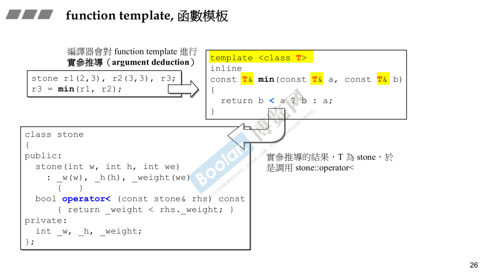

### 转换函数和隐式转换

==explicit一般用在构造函数前面，用于明确告诉编译器不要隐式转换，必须显式调用构造函数。==

#### conversion function转换函数

`operator 目标类型() const {return ...}; // 通常加 const，因为转换不应该修改对象` 

目标类型可以是另一个类

```c++
#include <iostream>

class AnotherClass {
private:
    double value;
public:
    AnotherClass(double v) : value(v) {}

    void print() const {
        std::cout << "AnotherClass value: " << value << std::endl;
    }
};

class MyClass {
private:
    int value;
public:
    MyClass(int v) : value(v) {}

    // 转换函数：MyClass -> AnotherClass
    operator AnotherClass() const {
        return AnotherClass(static_cast<double>(value));  // 转换为 double 再构造 AnotherClass
    }
};

int main() {
    MyClass obj(42);
    AnotherClass another = obj;  // 隐式转换：MyClass -> AnotherClass
    another.print();  // 输出 AnotherClass value: 42

    return 0;
}
```


上述例子是隐式转换，将f转换为double类型

隐式转换在编译期进行检查

#### non-explicit-one-argument ctor 隐式构造函数

非显式的单参数的构造函数

可以接受一个实参来构造对象，隐式转换，如下图，将4转换为Fraction对象


下图有二义性，因为对象f可以转换为double，4可以隐式转换为fraction对象


#### explicit-one-argument ctor 显式构造函数

禁止隐式转换

下图中4无法被转换为fraction对象，f虽然可以转换为double，但是相加后无法隐式构造d2


#### 转换函数的示例

下图中vector保存bool值，operator[]应该返回bool值，因此reference应该有转换函数，将其转为bool。


### 两种class

#### pointer-like class ，关于智能指针

实现一个像指针的类，用于封装更多的功能。比如智能指针。

这种class需要重载解操作符  `解引用*和箭头符号-> `

下图中`sp->`会被转换为`px`，c++中规定`->`得到的东西会继续通过`->`作用下去，即`px->`继续作用。


#### pointer-like class ,关于迭代器

迭代器需要重载`* -> ++ --`这些运算符

下图的`self operator++(int) ` 是重载后置递增


上图是__list_node的迭代器，对iterator解引用之后，应该取出data

同样的，`->`的行为应该是取data之后，再取data的地址

这和智能指针的实现是不同的。


#### function-like class  ，仿函数

如何像函数，需要重载函数调用操作符()


上图的灰色部分是有内容的，有继承


unary_function指仿函数只有一个参数，binary_function是仿函数有两个参数

这是STL部分的内容

### namespace

防止命名空间冲突，不同部门或者模块可以放在不同的namespace中


### 模板

#### class template

使用时要指明类型


#### function template

函数调用时，根据参数推断类型，不需要显式指定。

模板本身可以编译通过，再使用时，指定类型后会再编译一次，这一次可能编译失败，如下图中，stone如果没用重载`operator<`则会编译失败。



#### member template

即黄色部分，他是外围template的一部分，且本身也是template。


用法示例：


上面例子中，p2的first和second变量是Base类型，但是用Derived类型初始化的。

下面这个智能指针的例子中，允许用Derived指针初始化Base指针。因此需要实现member template。

上行转换是允许的。


#### 模板特化

泛化和特化是相反的。

模板就是泛化的一种，用的时候再指定类型。类型可以多种。

特化就是指定类型后重新实现template。


 上图中hash<long>()表示创建临时对象，(1000)表示调用operator()

#### 偏特化

即局部特化

个数上的偏特化和范围上的偏特化。

如STL为vector<bool>实现了偏特化，使用单个bit保存bool值。

范围上的偏，如将任意类型T缩小为指针类型T*，为指针类型T实现一套代码。

C<string*> 使用下面特化的代码。


#### 模板模板参数

即模板作为模板参数


上图中`XCls<string,list> mylist1`用法错误，语法错误。原因XCls的声明中没有为list指定好list的全部模板参数。

通过声明一个Lst可以解决。

stl中list如下：

```c++
template <class T> 
struct __list_node{
	typedef void* void_pointer;
	void_pointer prev;
	void_pointer next;
	T data;
}

template<class T,class Alloc=alloc>
class list {
protected:
    typedef __list_node<T> list_node;
public:
    typedef list_node* link_type;
private:
    link_type node;
  
...
}
```

另一个例子，其中shared_ptr和auto_ptr只接受一个模板参数，XCls可以编译通过。


下图不是模板参数，因为list<int>不是模板了，已经指定int了，无需推断。

对比`XCls<string,list> mylist1`，其接受的第二参数list是个模板，需要根据传入的T推断类型。


### 关于STL

容器 算法 迭代器 仿函数


### 通过宏__cplusplus确认是否支持c11

