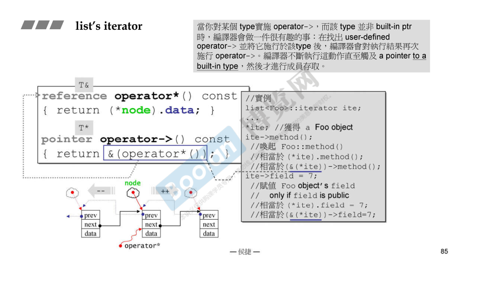
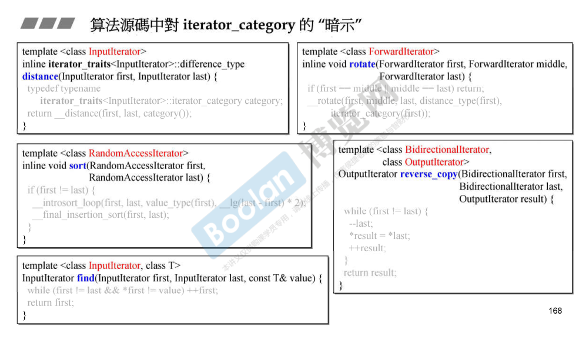
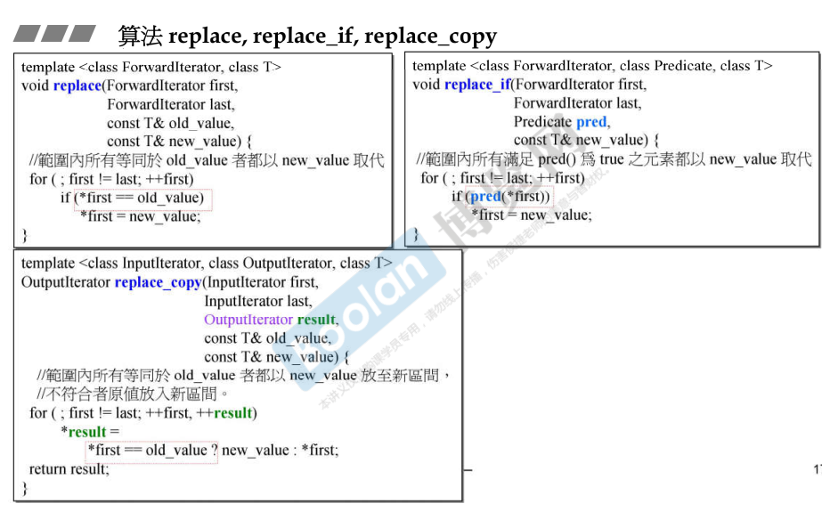

cpp标准库和STL不同，后者是标准模板库。

1. **STL（Standard Template Library）**
   - 容器（`vector`, `map`, `set`）
   - 迭代器（`iterator`）
   - 算法（`sort`, `find`）
   - 函数对象（`function`, `bind`）
2. **非 STL 组件**
   - 输入/输出（`<iostream>`, `<fstream>`）
   - 多线程（`<thread>`, `<mutex>`）
   - 智能指针（`<memory>` 中的 `unique_ptr`, `shared_ptr`）
   - 字符串处理（`<string>`）
   - 数值计算（`<numeric>`, `<random>`）

### STL体系介绍 


### 容器分类和测试

参考课件代码test_array等


#### array


 #### vector

测试发现 

* 扩容按照2倍的方式
* 不管vector的元素是否实现了移动构造和赋值函数，**对vector使用移动构造和swap的效率很高**；原因在于，**vector的底层维护的是动态数组的起始指针，对vector使用移动构造只需要交换指针**。同理，对两个vector进行swap的效率也很高，这是因为swap使用移动语义实现，调用了vector的移动赋值和构造函数。
* 当vector的**元素是包含指针的类对象时，若类实现了移动语义，则vector扩容时**，在新空间构造元素时**会利用元素的移动语义**，避免了拷贝构造的操作，从而更快。
* 对vector使用快排qsort和binary_search的速度未必比std::find快，原因在于快排耗时。
* 使用vector的insert时

```shell
how many elements: 100000000

test_vector().......... 
capacity change from 0to 1
capacity change from 1to 2
capacity change from 2to 4
capacity change from 4to 8
capacity change from 8to 16
capacity change from 16to 32
capacity change from 32to 64
capacity change from 64to 128
capacity change from 128to 256
capacity change from 256to 512
capacity change from 512to 1024
capacity change from 1024to 2048
capacity change from 2048to 4096
capacity change from 4096to 8192
capacity change from 8192to 16384
capacity change from 16384to 32768
capacity change from 32768to 65536
capacity change from 65536to 131072
capacity change from 131072to 262144
capacity change from 262144to 524288
capacity change from 524288to 1048576
capacity change from 1048576to 2097152
capacity change from 2097152to 4194304
capacity change from 4194304to 8388608
capacity change from 8388608to 16777216
capacity change from 16777216to 33554432
capacity change from 33554432to 67108864
capacity change from 67108864to 134217728
micro-seconds : 9552166
vector.max_size()= 288230376151711743
vector.size()= 100000000
vector.front()= 201083078
vector.back()= 487522885
vector.data()= 0x7fd91dd6e010
vector.capacity()= 134217728
vector last value 487522885
target (0~2147483647):    0
std::find(), micro-seconds : 715853
not found! 

sort(), micro-seconds : 47167972
bsearch(), micro-seconds : 5
not found! 


test, with moveable elements
construction, micro-seconds : 13885425
size()= 100000000
8MyString -- 
 CCtor=0 MCtor=234217727 CAsgn=0 MAsgn=0 Dtor=234217727 Ctor=100000000 DCtor=0
copy, micro-seconds : 3632080
move copy, micro-seconds : 2
swap, micro-seconds : 0


test, with non-moveable elements
construction, micro-seconds : 17951088
size()= 100000000
11MyStrNoMove -- 
 CCtor=234217727 MCtor=0 CAsgn=0 MAsgn=0 Dtor=234217727 Ctor=100000000 DCtor=0
copy, micro-seconds : 6065149
move copy, micro-seconds : 1
swap, micro-seconds : 1 
```

#### list

* 标准库提供了sort全局算法，list也提供了自己的sort算法。

#### forward_list

只能push_front，只能从头到尾遍历

### 源代码位置

GNU是一个开源组织，其提供了gcc等编译器，gcc提供了STL

gcc还会在/usr/include/x86*_64-linux-gnu/*搜索头文件。

`x86_64-linux-gnu` 表示 **64 位 x86 架构（AMD64/Intel 64）的 Linux 系统**，使用 GNU 工具链（如 GCC、glibc）。

gcc-9的C++头文件位置一般在/usr/include/c++/9，该路径下包含vector，list，mutex，memory等头文件。

**vector文件中包含#include <bits/stl_vector.h>，指向vector的实际实现。**

bits下包含stl_vector.h等 ，即vector的实现


### OOP和GP(Genreric Programming)

* **list不能使用std:sort**

  `std::sort` 的典型实现（如快速排序、内省排序）依赖以下操作：

  ```c++
  // std::sort 内部可能使用的操作（伪代码）
  auto mid = begin + (end - begin) / 2;  // 计算中间位置（要求随机访问）
  std::swap(*begin, *(begin + 5));       // 直接跳转到第 5 个元素（要求随机访问）
  ```

**要求容器提供随机访问迭代器（Random Access Iterator）**。而 `std::list` 的迭代器是 **双向迭代器（Bidirectional Iterator）**，无法满足 `std::sort` 的要求


### 分配器allocator

VC GNU-C是不同的编译器和工具链。前者是Microsoft的MSVC，后者是gcc/g++，他们有不同的标准库和STL的实现版本。

查看源码 可以知道 std::allocator最终调用了operator new，从而调用malloc 

下面是VC和GNU-C的不同实现的代码

##### VC如下

##### GNU-C2.9


**GNU-C2.9中容器使用了alloc分配器**


使用malloc分配的内存块，其头尾包含一些信息（比如块大小，块状态），malloc是动态内存分配器，底层需要管理空闲内存块，方法有：显示空闲链表、隐式空闲链表、分离链表等，这些方法的实现都用到了内存块头部信息。

而**GNU-C2.9实现了基于malloc的内存池分配器alloc，其实现如下**：下图是16种不同大小的空闲链表，0号链表内存块为8字节，之后的链表按8字节等差递增。alloc使用molloc申请了连续了内存块，然后将这些连续的内存块分割成空闲链表。

以vector为例，当其保存一百万个元素时，假设元素大小为56。使用下面的某个链表，为vector分配内存。于是vector的单个元素就没有头部信息了，而是一百万个元素共享malloc给出的大的内存块的头部信息。这个内存块分成了一百万份小内存块依次保存单个元素。好处是节约了内存，不需要为每个元素保存元素使用的小的内存块信息。


##### GNU-C4.9


**GNU-C4.9中alloc改名为pool_alloc**


**GNU-C中容器使用的是stl::allocator 而不是pool_alloc**

但可以手动指定分配器为pool_alloc


### sizeof component

```shell
test_components_size().......... 
sizeof(array<int,100>)= 400
sizeof(vector<int>)= 24
sizeof(list<int>)= 24
sizeof(forward_list<int>)= 8
sizeof(deque<int>)= 80
sizeof(stack<int>)= 80
sizeof(queue<int>)= 80
sizeof(set<int>)= 48
sizeof(map<int,int>)= 48
sizeof(multiset<int>)= 48
sizeof(multimap<int,int>)= 48
sizeof(unordered_set<int>)= 56
sizeof(unordered_map<int,int>)= 56
sizeof(unordered_multiset<int>)= 56
sizeof(unordered_multimap<int,int>)= 56
sizeof(_Rb_tree<...>)= 48
sizeof(array<int,100>::iterator)= 8
sizeof(vector<int>::iterator)= 8
sizeof(list<int>::iterator)= 8
sizeof(forward_list<int>::iterator)= 8
sizeof(deque<int>::iterator)= 32
sizeof(set<int>::iterator)= 8
sizeof(map<int,int>::iterator)= 8
sizeof(multiset<int>::iterator)= 8
sizeof(multimap<int,int>::iterator)= 8
sizeof(unordered_set<int>::iterator)= 8
sizeof(unordered_map<int,int>::iterator)= 8
sizeof(unordered_multiset<int>::iterator)= 8
sizeof(unordered_multimap<int,int>::iterator)= 8
sizeof(_Rb_tree<...>::iterator)= 8
sizeof(      std::allocator<string>)=1
sizeof(__gnu_cxx::malloc_allocator<string>)= 1
sizeof(__gnu_cxx::new_allocator<string>)= 1
sizeof(__gnu_cxx::__pool_alloc<string>)= 1
sizeof(__gnu_cxx::bitmap_allocator<string>)= 1
sizeof(__gnu_cxx::__mt_alloc<string>)= 1
sizeof(__gnu_cxx::array_allocator<int>)= 16
sizeof(__gnu_cxx::debug_allocator<std::allocator<double>>)= 16
```

# 容器

### 深度探索list

**G2.9版本的list只保存了一个node指针**，内部是一个环状链表，且包含一个空node用来表示end。因为容器都是前闭后开区间。

#### 内部结构


#### ⭐list_iterator

iterator的实现和使用 ，**（是一个pointer-like class），包含一个node指针** ，**需要重载解引用和箭头操作符，前置++和后置++。** 


后置++ 返回的是一个右值（临时对象）

下图中 `self temp=*this` 隐式转为 `self temp(*this)`，调用拷贝构造函数




#### G4.9对G2.9的改进

上述是G2.9，下面是G4.9；

改进1：iterator的别名更简单，__list_iterator只有一个模板参数TP

改进2：不再采用void*的类型的prev和next


G4.9的实际实现更复杂，有一些继承和组成关系。但仍然包含一个List_node_base<_Tp>实例。


#### 双向环状list，且包含一个空node

**所有的容器都是前闭后开区间，这样end()返回一个不属于容器的位置。**


### ⭐迭代器的设计原则和iterator trait的设计    

下图是一个rotate算法，箭头指示了算法的调用过程，其中`__iterator_category`萃取了iterator的类型（前进，后退，随机访问的，跳着走的等），`__rotate`还萃取了difference_type（迭代器距离）和value_type

下图RAI指的是 `__iterator_category`返回的是`random_access_iterator_tag`

iterator需要回答算法的这几个问题。


#### ⭐ iterator相关的五种类型-便于回答算法的提问

其中difference_type指的是两个迭代器的距离（即元素个数）。是有符号整数类型。

bidirectional_iterator_tag指的是双向迭代器类型。


由于iterator（迭代器）未必是个class，而可能是一个原生指针，因此需识别iterator是那种，并且回答相关的value_type等。

**于是产生了Traits，萃取机。用来分离class iterator和non-class iterator**

****

#### iterator_traits及范围特化

下面的2、3是特化的iterator_traits，当iterator是non class时，则会起作用。


### traits有很多种


### 深度探索vector

**vector是动态数组，维护三个迭代器变量，start，finish，end_of_storage**。所以sizeof大小是8*3=24.


而G4.9中，vector比较复杂，像list一样，有复杂的基础和组合关系。


#### 扩容

push_back和insert都会触发扩容，都会间接调用insert_aux函数。

其中insert涉及元素的向后搬移。


#### vector iterator

traits要从iterator获取五种相关类型

##### G2.9

在G2.9中，vector的iterator是元素指针 T*。


##### G4.9

G4.9中vector's iterator变成了class。

但是，其内部封装的数据指针M_current，推导后发现依然是个元素指针 _Tp*


### 深度探索array 

array的简单实现，利用一个数组


array的G4.9版本，底层仍然是数组，但是由array_traits定义 `typedef _Tp _Type[_Nm]`


### forward_list

对比list即可，相比之下Fwd_list_node_base指维护前向指针。


### ⭐深度探索deque queue stack 

#### deque

使用一个map数组（指针数组、控制中心）指向数个buffer。


* 包含四个成员变量 start finish map map_size。start和finish分布指向头尾，并且前闭后开。

* start如图所示，是一个迭代器类型，内部含有四个成员。可以跳到控制中心


##### ⭐ deque iterator

包含cur first last node，其中node是二级指针。指向map元素的地址。map元素又是buffer地址。


 ##### deque insert

insert判断插入位置是不是头或尾，若是，调用push_front和push_back，若不是，调用insert_aux


##### deque如何模拟连续区间：利用iterator

需要实现buffer的跳转判断。

注意finish指向位置的是不存在元素的，即前闭后开。


重载operator-，其中node是二级指针，指针相减表示指针所指元素的距离。


重载++和--，分为前置和后置，一般是先实现前置，后置的实现里调用了前置运算(`++*this`)。


##### G4.9


#### queue和stack

内含一个deque 且只提供deque的部分接口。


#### ⭐ queue和stack不提供iterator 也不允许遍历

* queue和stack也可以使用list作为底层


### 红黑树 RB-tree

* 平衡（叶子节点的深度差不超过1） 的二分查找树。

* 对其默认遍历-中序遍历（左中右）会得到由小到大的排列状态。


* set和map是按照key在rb-tree中排序的，也是按照key查找的。

* **rb-tree允许元素重复**，即可以用来实现multiset。

#### ⭐实现

内部只维护header指针，node_count和key_compare


* **value由key和data组成。**
* 需要知道如何获取key ， key如何排序


less和identity都是仿函数，提供获取key和排序的方法。


##### 用例


### set multiset

value就是key 没有data


* set的iterator是const的。原因是set底层是rb-tree，且按照数据进行排序，利用iterator修改元素破坏红黑树的排列规则。

##### 关联容器提供了find和count

* **set提供了count和find方法。比std::find效率更高。**


### map multimap

**区别是value包括key和data**，`pair<const Key,T> value_type`

const 防止修改key，且rb-tree把key进行排序。


##### map提供了find方法


##### map重载了operator[]


### hashtable

- STL通常使用一组质数作为桶数（如53, 97, 193, 389...）, buckets是一个vector<node*>
- 当容器中的元素数量(`size()`)大于桶的数量(`bucket_count()`)时，容器会自动进行rehash操作。
- 使用链地址法处理哈希冲突（不同的key在一个bucket）
- hashtable的value一般包括key和data


仿函数不含成员变量 对象大小为1字节

例子如下

  

##### stl提供的哈希函数

* 基本类型int char 直接返回；字符串经过简单计算


##### modulus运算（取余）

* 通过取余 计算元素在哪个bucket


### hash_set hash_multiset hash_map hash_multimap


unordered_set等提供了bucket_count()接口

一般buckets大于元素个数

# 算法

* 算法是模板函数。
* 使用算法时，一般传入迭代器和比较准则（仿函数）


### 迭代器分类：五种


* array vector deque是random_access_iterator_tag，连续空间（deque模拟了连续空间）

* list是bidirectional_iterator_tag

* forward_list是forward_iterator_tag

* 底层为rb-tree的set和map是bidirectional_iterator_tag

* 底层为hashtable的set和map是forward_iterator_tag

下面通过重载_display_category打印了这些信息


使用typeid获取类型名称


#### 特殊的istream_iterator和ostream_iterator


#### iterator_category对算法的影响

##### 计算迭代器距离difference

1和2是重载了两个版本_distance，针对input_iterator_tag和random_access_iterator_tag


* 所以random_access_iterator计算distance更快

##### 迭代器前进

不同的迭代器前进方式不一样，下面重载了三种_advance

* random_access_iterator可以一次走多步，**因为空间连续，重载了operator+**

* 而其他的只能一次走一步


##### 为什么没有重载forward_iterator_tag为参的版本

因为forward_iterator_tag   **is a** input_iterator。

#### copy算法为例 分析iterator_category的影响

如果iterator是const char*，则调用速度较快的memmove 


 

#### __unique_copy

不同的iterator类型调用不同的函数


### 算法剖析

算法其实无法指定迭代器类型，因为算法是模板函数。

但是可以“暗示“迭代器类型。



#### accumulate

两个版本


从例子中可以看到，可以向accumulate传入仿函数的实例或者传入函数。

**传入函数时，BinaryOperation被推断为了函数指针，实参为myfunc函数地址。**

#### for_each


#### replace replace_if replace_copy



#### count count_if


#### find find_if


#### sort


#### reverse iterator: rbegin() ,rend()

反着遍历


#### binary_search-> lower_bound ,upper_bound

针对有序序列，二分查找


### 仿函数 functors

* 服务算法 ，提供算法的准则


* 仿函数的父类：规定操作数有几个


### 适配器  Adapters

* **适配器只是为了改变接口  ，让接口符合要求（函数名称 函数参数等符合要求）**

* **使用has-a的方式，新接口内部使用原有接口实现。**


#### 容器适配器 stack queue

内含一个deque，并改造deque的接口


#### 仿函数适配器


#### 迭代器适配器


